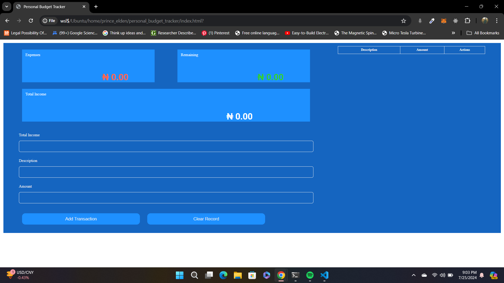

# Personal Budget Tracker


### Introduction

A simple frontend-based web application aimed at helping the average person calculate and track their personal expenditure based on a given income provided by the user.

### Setup Instructions
To setup the project simple follow the following steps:
- Clone this repo:
```
```
- Copy the path to the `index.html` file at the root of the directory and paste said path in any browser of your choice (preferrably Chrome)

- You should see an image that looks something like the following image:


**OR** you can just visit the live webpage using the link provided in the `Abouts` section of this repo (I hope it still works)

### How To Use

Usage of the app is very simple. It is essence a basic CRUD app:
- On your first use of the application, you must specify a `Total Income` which must be a number, trying to input anything other than a number simply doesn't work.
- Then, you provide a suitable description of the transaction you wish to record.
- Then, you specify the amount it would cost to carry out the aforementioned transaction.
- The app is able to persist data, so on refreshing the page, none of your initial expense calculations would be lost.
- To the rightmost of the page or at the bottom if you're viewing the site using a mobile smartphone, is a records table containing the records of the transactions entered into the system. You can also see a `Delete` button, clicking on this button will cause the record containing it to be deleted from the record table.
- And if you feel ready to start a new budget with a new income specification, you can enter a new income value in the `Total Income` input field which will change the value on the boards correspondingly.
- And you can erase all records by clicking on the `Clear Record` button.
- I leave the rest of the app in your hands to figure it out. 😅